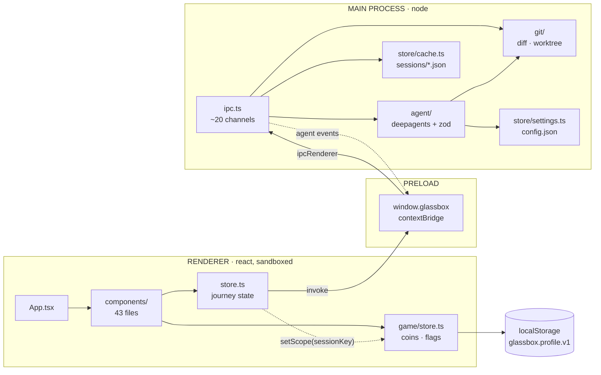
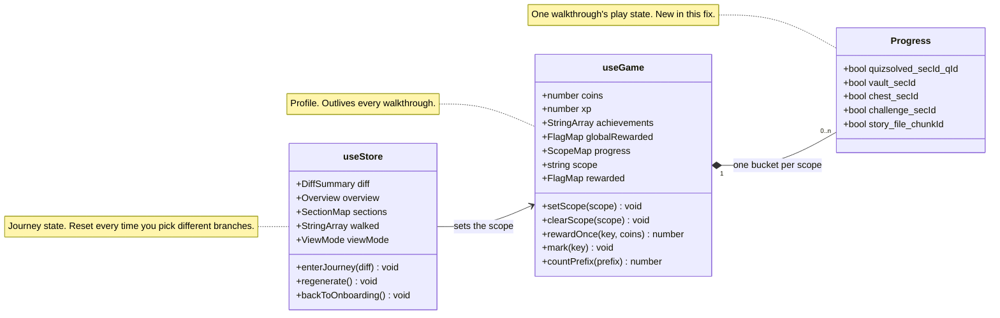
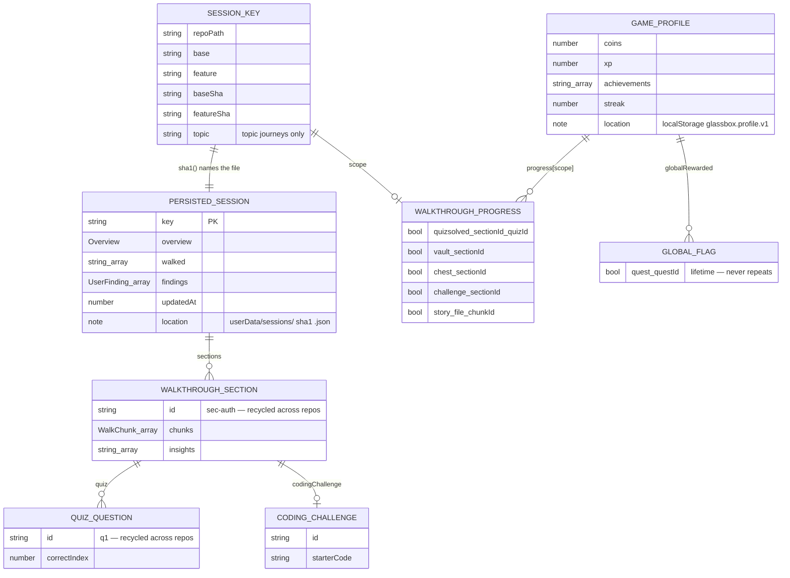
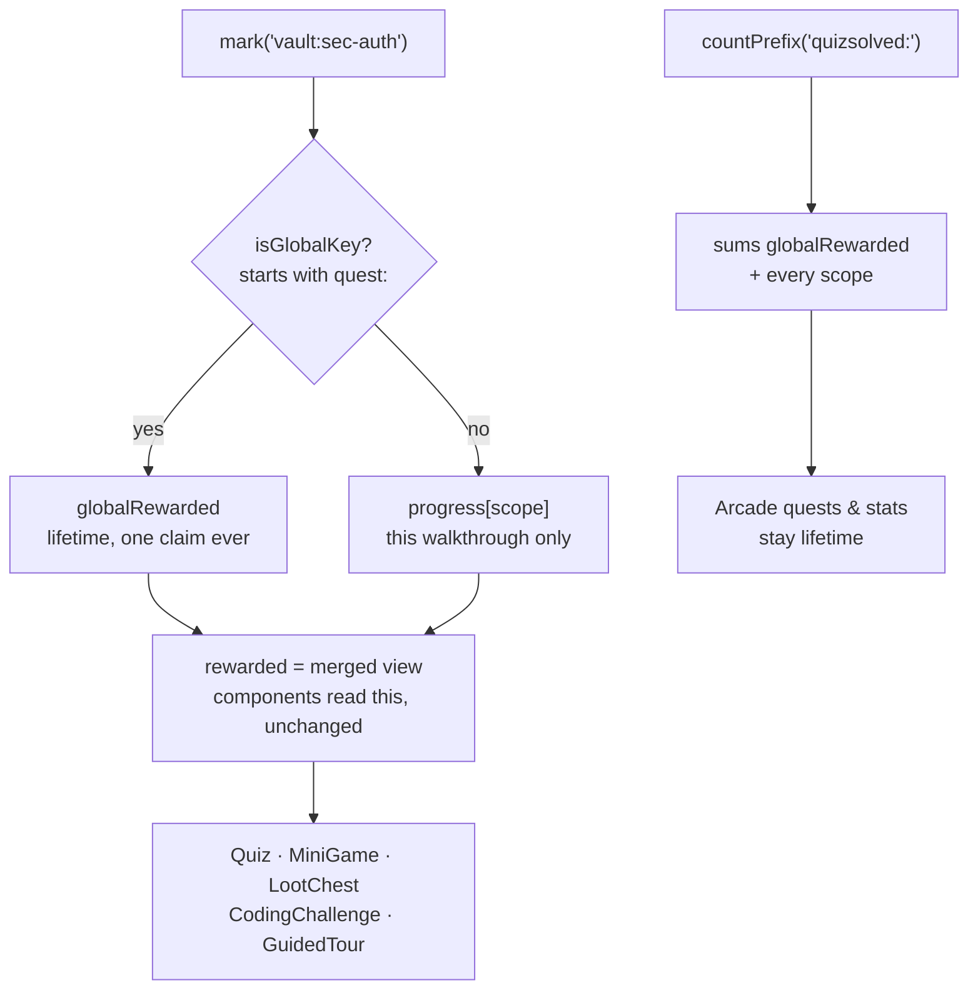

# Architecture — and where the progress-scoping fix landed

A map of the codebase: how the three process layers talk, which store owns what, what
actually persists, and the seam where quiz / vault / chest progress was leaking between
walkthroughs (fixed in `194fa85`).

---

## 1. The shape of the repo

Standard `electron-vite` three-target layout. Each top-level folder under `src/` is a
separate build target with its own tsconfig — they cannot import each other freely, which
is why `shared/` exists. ◂ marks the files the progress-scoping fix touched.

```
src/
├── main/                       Node side. Full fs/git/network access.
│   ├── agent/
│   │   ├── agent.ts            the deepagents run loop: overview, section, chat, review
│   │   ├── model.ts            provider factory — anthropic | opencodezen | ollama | bedrock | vertex
│   │   ├── schema.ts           zod contract the model fills via submit_* tools
│   │   └── tools.ts            repo_ls / repo_grep / repo_read / repo_diff + makeSubmitTool
│   ├── git/
│   │   ├── diff.ts             branch list, diff computation, SHA resolution
│   │   └── worktree.ts         isolated checkout so the agent reads the feature branch safely
│   ├── store/
│   │   ├── cache.ts            walkthrough JSON on disk, filename = sha1(sessionKey)
│   │   └── settings.ts         config.json — provider, model, API key
│   ├── index.ts                BrowserWindow, Sentry, worktree cleanup
│   ├── ipc.ts                  ~20 ipcMain.handle channels, each Sentry-wrapped
│   └── updater.ts
├── preload/
│   └── index.ts                contextBridge → window.glassbox. The only door between the two worlds.
├── renderer/                   React 18 + zustand + tailwind + framer-motion. Sandboxed.
│   ├── components/             43 files — Walkthrough, GuidedTour, SectionCard, Quiz, MiniGame…
│   │   └── Walkthrough.tsx     ◂ touched — one dialog string
│   ├── game/
│   │   ├── store.ts            ◂ touched — the fix itself
│   │   ├── cosmetics.ts        shop items
│   │   ├── powerups.ts         timed boosts
│   │   └── sfx.ts              sound packs
│   ├── lib/                    files.ts (cn, file fetch), highlight.ts (shiki), threeStage.ts
│   ├── App.tsx                 two screens: Onboarding | Walkthrough
│   └── store.ts                ◂ touched — journey lifecycle wiring
└── shared/
    ├── types.ts                the contract both processes compile against
    └── sentry-config.ts
```

---

## 2. How the three layers talk

The renderer never touches git, the filesystem or the model. It asks `window.glassbox`, the
preload bridge forwards to an `ipcMain` channel, and the main process does the work. Agent
progress flows back as streamed events.



That dotted `setScope` arrow is the entire structural addition: the journey store now tells
the game store *which* walkthrough is on screen.

---

## 3. Two stores, two lifetimes

Both are plain zustand stores in the renderer, and the split between them is the heart of
the bug. `useStore` is the walkthrough you are looking at — it resets whenever you pick
different branches. `useGame` is your account — coins, level, achievements — and is meant to
outlive every walkthrough. One-shot play flags were filed in the second store while
semantically belonging to the first.



`rewarded` kept its name and its shape, so all 43 components read it exactly as before. It
is now a derived view — `globalRewarded` merged under `progress[scope]` — which is why the
fix is 3 files instead of 18.

---

## 4. What actually persists

Two independent stores of record, keyed differently — and that mismatch *is* the bug. The
walkthrough cache on disk is keyed by repo, branches and both commit SHAs. The game profile
in localStorage was keyed by nothing at all.



Note the two `id` fields flagged *recycled*. The agent picks section ids like `sec-auth` and
quiz ids like `q1` for every repo it has ever been pointed at. Those ids were the only thing
the play flags were keyed by.

---

## 5. The bug, as a picture

**Before** — one flat map. Write `quizsolved:sec-auth:q1` in repo A, read it back in repo B:

- quiz renders with the answer pre-highlighted
- vault reads *"cracked ✓ — replay for fun"*
- chest reads *"opened ✓"*
- chunk stories already revealed, insight slots already pulled

**After** — same key, filed under the active `scope`; quest claims still go to the flat map:

- new branches → clean slate
- same branches, same SHAs → resumes
- `regenerate` → drops that scope
- lifetime counts unchanged: they sum every scope



---

## 6. The three files, and why each one

| File | Role | Δ |
| --- | --- | --- |
| `src/renderer/game/store.ts` | the fix | +100 / −6 |
| `src/renderer/store.ts` | lifecycle | +10 / −0 |
| `src/renderer/components/Walkthrough.tsx` | copy | +1 / −1 |

**`game/store.ts`** owns the profile, so it owns the bug. Split the one flat `rewarded` map
into `globalRewarded` (quest claims) plus `progress` keyed by scope, and made `rewarded` a
derived merge of the two. `mark` and `rewardOnce` route by key prefix; `countPrefix` sums
across every bucket so quests and the stats tab keep meaning "ever". Added `setScope` /
`clearScope`, plus a one-time migration that parks pre-existing flags in a legacy bucket —
they still count for stats, they just no longer pre-solve anything.

**`store.ts`** is the only place that knows which walkthrough is current — it already
computes the session key for the disk cache. Three call sites: `enterJourney` points the
scope at that key, `backToOnboarding` clears it, and `regenerate` drops the old scope
because the sections it described no longer exist.

**`Walkthrough.tsx`** — the regenerate dialog promised "your coins and progress stay". Half
of that is no longer true: coins, XP and achievements stay, but this walkthrough's quizzes,
vaults and chests now reset with the sections.

### Key routing reference

| Key | Written by | Bucket |
| --- | --- | --- |
| `quest:<id>` | `Arcade.tsx` | lifetime |
| `quizsolved:<sec>:<q>` | `Quiz.tsx` | per walkthrough |
| `vault:<sec>` | `MiniGame.tsx` | per walkthrough |
| `chest:<sec>` | `LootChest.tsx` | per walkthrough |
| `challenge:<sec>` | `CodingChallenge.tsx` | per walkthrough |
| `story:<file>:<chunk>` | `SectionCard` · `GuidedTour` | per walkthrough |
| `insight:<sec>:<i>` | `Insights.tsx` | per walkthrough |
| `selfcheck:<sec>` | `SelfCheck.tsx` | per walkthrough |
| `hunt:*` | `BugHunt.tsx` | per walkthrough |
| `lesson:*` · `poke:*` · `trace:*` | `LessonMode` · `PokeableCode` | per walkthrough |

---

## 7. Deliberately left alone

- **The agent, the schema, the prompts.** Generation was verified healthy first: a fresh run
  returned 3 quiz questions, a coding challenge, insights and traces, and the payload passed
  `sectionSchema`. Nothing was missing — it was arriving and rendering as already-played.
- **The 43 components.** Keeping `rewarded` as a same-shaped derived view meant zero
  call-site churn.
- **Coins, XP, level, streak, achievements, cosmetics, SRS deck, speedrun bests.**
  Account-level by design.
- **Per-user profiles.** Still one profile per machine — the scope added here is per
  walkthrough, not per person. That remains open.
